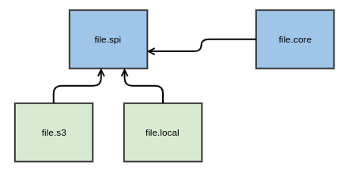

# Providing SPIs

- Status: draft
- Deciders: als, rwei, rew
- Date: 2022-08-09
- Tags: spi, api

## Context and Problem Statement

We are currently reimplement a lot of features and make it possible that things
are extendable without relasing the Axon Ivy Platform e.g.

- Identity Provider (Microsoft AD, Novell eDirectory, Azure AD)
- File Storage (Local, S3)
- Notification (Mail, Teams)

Then we need to define APIs which needs to be implemented (SPI = Service
Provider Interface). So we have a SPI's for identity providers, file storages
and notifications.

How do we organize such code?

## Decision Outcome

- Own bundle for SPI's whenever possible
- SPI is reflected in the package name
- Code which is only used by us, do we move in core bundle and package

### Example

- We provide a SPI for file storage with the `file.spi` bundle.
- We have two implementations `file.local` and `file.s3`.
- We have code which is only needed by us in `file.core`.

The Java packages reflecting these namings:

- ch.ivyteam.ivy.file.core
- ch.ivyteam.ivy.file.spi
- ch.ivyteam.ivy.file.s3
- ch.ivyteam.ivy.file.local

### Positive Consequences

- Small bundles with with clear responsibility
- Easier dependency management between bundles
- Possible way out of the OSGI visibilities

### Negative Consequences

- More bundles
